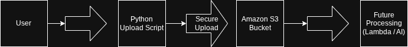

## Secure Tax Document Intelligence System
An AI-powered, memory-resident processing engine for sensitive tax documents.

This system is designed to allow tax professionals to upload, store, and process sensitive client documents securely while maintaining auditability, validation, and scalability.

---

## 🚀 Getting Started

# Prerequisites
- Python 3.11+
- AWS CLI configured with `us-east-1`
- Active S3 Bucket: `tax-doc-system-chim-dev`
- AWS IAM credentials with access to:
  - S3 (PutObject)
  - Textract (AnalyzeDocument)

Recommended environment variables:
- `TAX_APP_S3_BUCKET`
- `TAX_APP_AWS_REGION`
- `TAX_APP_MIN_CONFIDENCE_SCORE`
- `TAX_APP_ENABLE_LOCAL_AUDIT_LOG`
- `TAX_APP_ENABLE_LOCAL_RESULT_STORAGE`

---

# Installation
1. Clone the repository  
2. Create a virtual environment: `python3 -m venv venv`  
3. Activate: `source venv/bin/activate`  
4. Install dependencies: `pip install -r requirements.txt`  

For local test tooling:
5. Install dev dependencies: `pip install -r requirements-dev.txt`

---

# Running the Application

Because the application uses a modular structure, always run the server from the **root directory**:

# Set the Python Path so internal modules are discoverable
export PYTHONPATH=$PYTHONPATH:.

# Start the FastAPI server
uvicorn src.api.main:app --reload

# Run the automated tests
pytest -q

# Optional: run with Docker
docker build -t tax-python-app .
docker run --env-file .env -p 8000:8000 tax-python-app

---

## Current Features

- Zero-Disk Processing: Documents are handled as in-memory byte streams to ensure no sensitive data is written to local storage.
- AI-Powered Extraction: Integrated with Amazon Textract for OCR and structured form extraction.
- Document Classification: Automatically identifies document types (W-2 supported).
- Typed FastAPI Contracts: Upload and health endpoints return validated response models.
- Environment-Driven Configuration: Bucket, region, confidence thresholds, and local persistence are configurable without code edits.
- Multi-Pass Extraction Engine:
  - KEY_VALUE extraction (primary)
  - LINE-based fallback
  - Regex-based precision extraction
- Structured W-2 Mapping: Extracts SSN, EIN, wages, and tax fields.
- Validation Layer: Separates invalid inputs from low-confidence-but-reviewable documents.
- Normalization Layer: Converts extracted values into clean, usable formats.
- Manual Review Routing: Low-confidence extractions are returned as `needs_review` instead of being silently discarded.
- Health Check Endpoint: `/health` supports uptime checks and deployment probes.
- Audit Logging (Optional Local): Local audit logging is available for development but disabled by default.
- Modular Backend Structure: Clear separation between ingestion, processing, and storage.

---

## Security

This system uses IAM policies to enforce least-privilege access.

- Restricted permissions to only allow file uploads and Textract analysis  
- Scoped access to a specific S3 bucket  
- In-Memory Lifecycle: Files are processed in RAM and uploaded to S3 without hitting the server file system by default  
- Dev-only Local Persistence: Audit and extracted-result files are now opt-in so production can avoid unnecessary local PII storage

---

## API File Validation
 
This system enforces strict validation rules:

- Only PDF files are accepted  
- Maximum file size limit: 5MB  
- Empty or invalid files are rejected before processing  

---

## System Flow

User --> FastAPI Ingestion --> AWS Textract --> Processing Pipeline --> AWS S3 --> Audit Logging

1. User provides a file via POST request  
2. System converts file to memory-resident byte stream  
3. API validates file extension, file size, and PDF signature before AWS calls  
4. Bytes are sent directly to Amazon Textract for OCR and form analysis  
5. Document is classified (W-2 detection)  
6. Multi-pass extraction is applied (KEY_VALUE → LINE → REGEX)  
7. Extracted data is validated  
8. Weighted confidence scoring determines `success` vs `needs_review`  
9. Data is normalized into structured format  
10. File is uploaded to AWS S3 via boto3  
11. Optional local metadata is written only when explicitly enabled  

---

## Document Processing

Uploaded documents are processed using a hybrid AI and rule-based system.

Pipeline:
- Extract text and form data via Amazon Textract  
- Classify document type (W-2 currently supported)  
- Extract key fields (SSN, EIN, wages, tax fields)  
- Apply multi-pass extraction for reliability  
- Validate extracted data  
- Normalize values into usable formats  

Results are stored in structured JSON format for downstream tax workflows.

---

## Audit Logging

The system can maintain a local audit log for traceability during development.

Each upload records:
- Timestamp (UTC)  
- File name  
- File size (calculated from byte stream)  
- Processing status  

Note: Local audit logging is disabled by default and can be enabled with `TAX_APP_ENABLE_LOCAL_AUDIT_LOG=true`.

---

## Storage Layer

This system uses Amazon S3 for secure, durable document storage.

Implementation:
- File uploads handled via Python (boto3)  
- Objects stored directly from memory to S3 bucket  
- No local disk persistence by default  
- IAM-restricted access  

---

## Delivery Tooling

- Dockerfile included for containerized deployment
- GitHub Actions CI workflow runs the automated test suite on pushes and pull requests
- `.env.example` documents runtime configuration

---

## Current Limitations

- Address extraction is heuristic-based (not layout-aware yet)  
- DynamoDB persistence is temporarily disabled  
- Only W-2 fully supported  
- Authentication and user-level authorization are not implemented yet  
- Infrastructure provisioning and deployment automation are not committed yet  

---

## Roadmap

- Implement AWS KMS (Key Management Service) for S3 encryption  
- Add JWT-based authentication for tax professionals  
- Reintroduce DynamoDB with structured schema  
- Build frontend dashboard for data verification  
- Expand support for additional tax forms (1099, Schedule C)  
- Introduce cost tracking and FinOps optimization  
- Add deployment automation and infrastructure-as-code for reproducible deployment

---

## Positioning

This project demonstrates:

- Cloud-native backend engineering  
- Serverless architecture design  
- AI-assisted document processing  
- Data validation and normalization pipelines  
- Secure handling of sensitive financial data
- Production-minded API design and testing

## Engineering Notes

- Detailed architecture and decision notes live in `docs/architecture/engineering-decisions.md`

## Architecture Diagram

